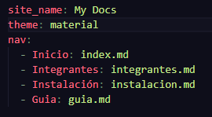

# Guía de implementación con MkDocs

- Al tener ya creado nuestro entorno virtual, primero instalamos las herramientas necesarias ejecutando pip install mkdocs mkdocs-material. Una vez instalado, ejecuta el comando mkdocs new . en la raíz de tu proyecto para generar la estructura inicial de archivos.

## Configuración del archivo mkdocs.yml

Este es el "cerebro" de el sitio. Aquí configuras el nombre del proyecto y, lo más importante, la navegación. Para crear rutas, abre este archivo y utiliza el bloque nav de esta forma:



- Recuerda que no es necesario tener las mismas rutas de la imagen, puedes crear tus propias rutas con los nombres que tú quieras, lo importante es que para cada ruta que pongas en el archivo mkdocs.md debe estar creado un archivo dentro de la carpeta "docs" que contenga el mismo nombre y la extensión (.md")

## Edición de la página principal (index.md)

- Dentro de la carpeta docs encontrarás el archivo index.md. Este es la sección principal del sitio. Puedes editarlo libremente usando Markdown:

- Para un título grande usa #.

- Para subtítulos usa ##.

- Para negritas usa **texto**.

- Para listas usa - elemento.
- para escribir como el efecto de código usa ``` adelante y al final del texto. 

## Cómo escribir y añadir páginas

Para crear nuevas secciones, simplemente crea un nuevo archivo con extensión .md dentro de la carpeta docs (por ejemplo, guia.md). Una vez creado, recuerda agregarlo al archivo mkdocs.yml en la sección nav que vimos antes para que aparezca en el menú superior.

## Visualización

Para ver cómo va quedando tu trabajo, ejecuta en la terminal:
mkdocs serve

Esto abrirá un servidor local (usualmente en http://127.0.0.1:8000). Cada vez que guardes cambios en cualquiera de tus archivos .md o en el yml, el navegador se actualizará automáticamente.

